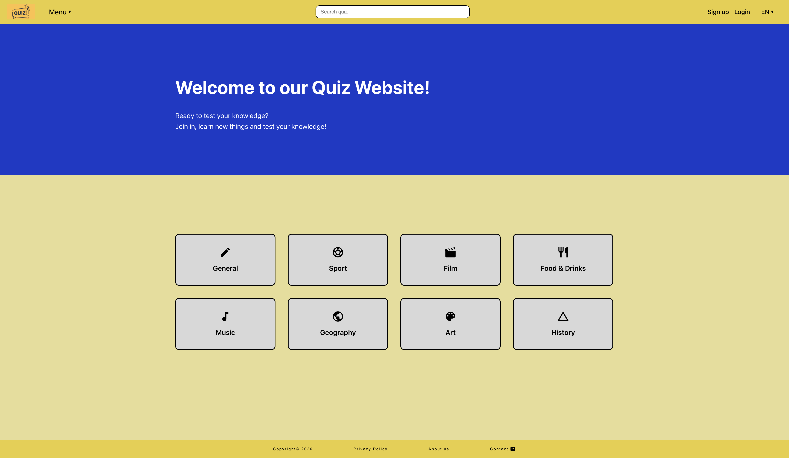
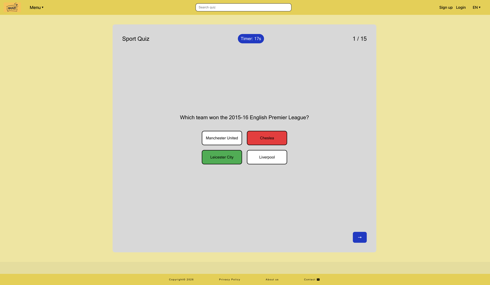
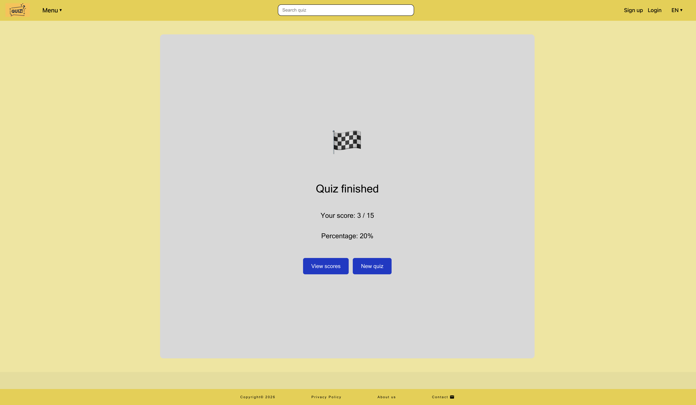
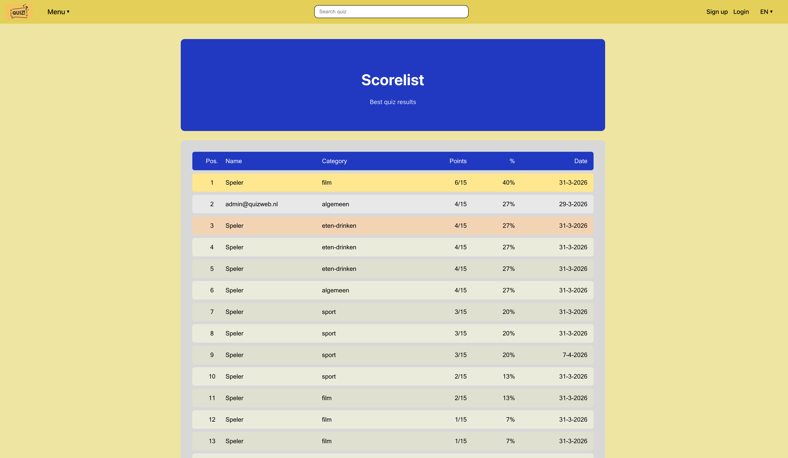

# # Quizweb – Interactive Quiz Application

Interactieve quiz website gebouwd met React & Vite | Interactive quiz website built with React & Vite

## Inhoudsopgave

1. [Inleiding](#inleiding)
2. [Screenshots](#screenshots)
3. [Functionaliteiten](#functionaliteiten)
4. [Technieken en frameworks](#technieken-en-frameworks)
5. [Voorwaarden vooraf](#voorwaarden-vooraf)
6. [Installatie](#installatie)
7. [Inloggegevens](#inloggegevens)
8. [Beschikbare scripts](#beschikbare-scripts)
9. [Projectstructuur](#projectstructuur)
10. [Bekende problemen](#bekende-problemen)

---

## Inleiding

Quizweb is een interactieve quizwebsite waar gebruikers hun kennis kunnen testen op verschillende categorieën zoals Algemeen, Sport, Film, Muziek, Geografie, Kunst en Geschiedenis. De applicatie is gebouwd als eindopdracht voor de Frontend opleiding bij NOVI Hogeschool.

**Belangrijkste functionaliteiten:**
- Quiz spelen in verschillende categorieën met een timer per vraag
- Scorelijst met top 3 ranking
- Registreren en inloggen
- Meertalig (Nederlands / Engels)
- Admin dashboard voor beheer van gebruikers, scores en berichten
- Contactformulier
- Responsive design (mobile, tablet, desktop)

---

## Screenshots
### 1. Home

### 2. Quiz

### 3. Quiz finish

### 4. Scorelist 


---

## Functionaliteiten

- Mogelijkheid om quizzen te spelen in verschillende categorieën
- Timer per vraag voor extra uitdaging
- Scorelijst met een top 3 ranking
- Registratie- en loginfunctionaliteit
- Meertalige ondersteuning (Nederlands en Engels)
- Admin dashboard voor beheer van gebruikers, scores en berichten
- Contactformulier voor gebruikersfeedback
- Responsive design voor mobiel, tablet en desktop
---

## Technologieën en frameworks

| Technologie | Versie | Doel |
  |---|---|---|
  | React | 18 | UI framework |
  | Vite | latest | Build tool en development server |
  | React Router | latest | Navigatie en routing |
  | Iconify | latest | Iconen |
  | Open Trivia API | - | Quizvragen ophalen |
  | NOVI Dynamic API | - | Gebruikersbeheer, scores en berichten |
  | CSS Flexbox | - | Layout en responsive design |
---
## Voorwaarden vooraf

Zorg dat de volgende software geïnstalleerd is voordat je begint:


- [Node.js](https://nodejs.org/) versie 18 of hoger 
- [Git](https://git-scm.com/) — download via git-scm.com
- Een code editor zoals [WebStorm](https://www.jetbrains.com/webstorm/) of [VS Code](https://code.visualstudio.com/)

Controleer installatie:
```bash
node -v
npm -v
```
---
## Installatie

Volg deze stappen om het project lokaal op te zetten:

**Stap 1 — Clone de repository:**
```bash
git clone https://github.com/I-Tosun/quizweb.git
cd quizweb
```

**Stap 2 — Installeer de dependencies:**
```bash
npm install
```

**Stap 3 — Configureer de omgevingsvariabelen:**

Hernoem het bestand `.env.example` naar `.env`:
```bash
mv .env.example .env
```

Het `.env` bestand bevat de volgende variabelen die al zijn ingevuld:
- `VITE_PROJECT_ID` — het project-ID voor de NOVI Dynamic API
- `VITE_TRIVIA_TOKEN` — de API-token voor de Open Trivia API

**Stap 4 — Start de applicatie:**
```bash
npm run dev
```


**Stap 5 — Open de applicatie in je browser: http://localhost:5173**
De applicatie is direct klaar voor gebruik — er hoeven geen API-keys aangevraagd te worden.
---

## Inloggegevens

De volgende accounts zijn beschikbaar:

| Email | Wachtwoord | Rol |
|-------|-----------|-----|
| admin@quizweb.nl | admin123 | Admin |
| user@quizweb.nl | user123 | User |

Het admin account geeft toegang tot het admin dashboard via het Menu.

---

## Beschikbare scripts

| Script | Commando | Beschrijving |
|---|---|---|
| Development server | `npm run dev` | Start de lokale development server op poort 5173 |
| Productie build | `npm run build` | Bouwt de applicatie voor productie in de `dist` map |
| Tests uitvoeren | `npm run test` | Voert alle unit tests uit |
| Preview build | `npm run preview` | Start een lokale preview van de productie build |

---
## Projectstructuur
```
src/
├── assets/          # Afbeeldingen en CSS bestanden
├── components/      # Herbruikbare componenten
├── helpers/         # Helper functies en vertalingen
├── hooks/           # Custom React hooks
├── layout/          # Layout componenten
├── pages/           # Pagina componenten
│   └── admin/       # Admin pagina's
├── services/        # API service functies
└── tests/           # Test bestanden
```
---

## Bekende problemen

- De NOVI Dynamic API database wordt dagelijks geleegd. Registreer opnieuw als je niet kunt inloggen.
- De taalwisseling herlaadt de pagina — quiz voortgang gaat verloren bij taalwisseling.
- Zorg dat je de applicatie draait op poort 5173 of 3000 om CORS-fouten te vermijden.

---
## Licentie

Dit project is gemaakt als eindopdracht voor NOVI Hogeschool en is niet bedoeld voor commercieel gebruik.